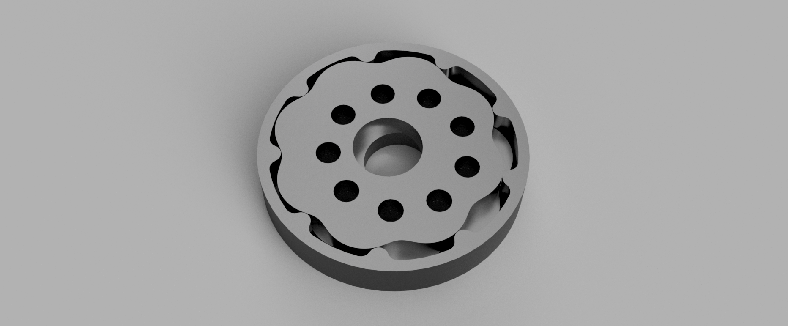

# Cycloidal Dual-Disc Sketch Generator (Fusion 360)

Small Fusion 360 script for generating cycloidal reducer sketches.

The main focus is proper dual-disc cycloidal drives: correct phasing and output holes that line up so both discs can drive the same output pins. Most generators only handle a single disc, so this was built to solve that.

It generates:
- Ring pins
- Output pins
- One or two cycloidal discs (optional)
- Automatic phase for dual-disc setups

It works for higher ratios as well, but very high pin counts can get heavy in Fusion and may cause sketch slowdowns or minor instability.

The disc shape is created from a cycloidal curve and drawn as a single spline to keep performance reasonable while staying accurate enough for printing or machining.

Reduction follows the usual rule:

Ratio = N − 1, where N is the number of ring pins.

This is a practical tool, not a polished product
